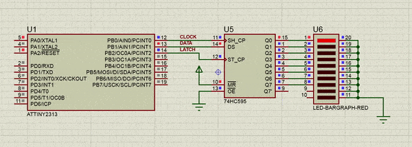

# Shift Register Example

This is my example of working with a shift register 74HC595 using an AVR microcontroller. This example does not use any data interface (SPI, USI). Instead, a small algorithm is implemented that controls the three pins of the microcontroller (DATA, LATCH and CLOCK).

